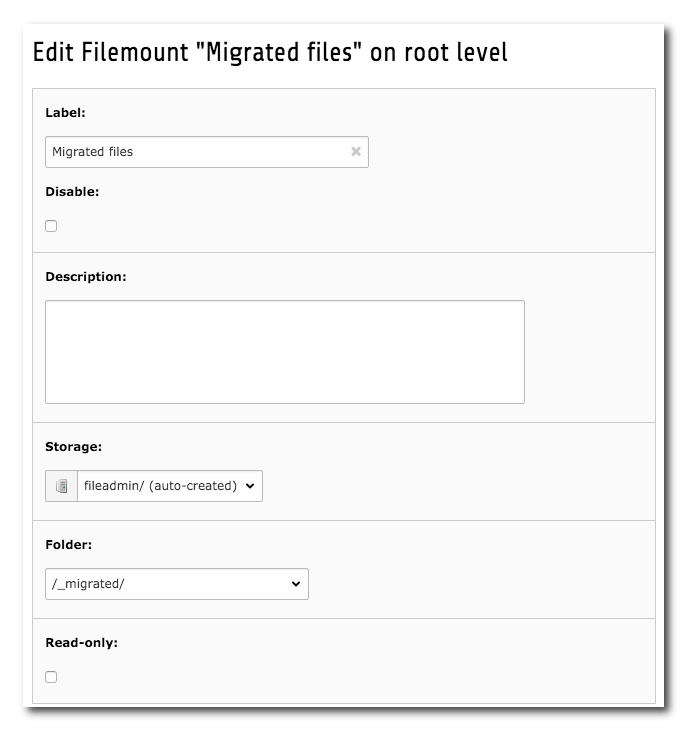
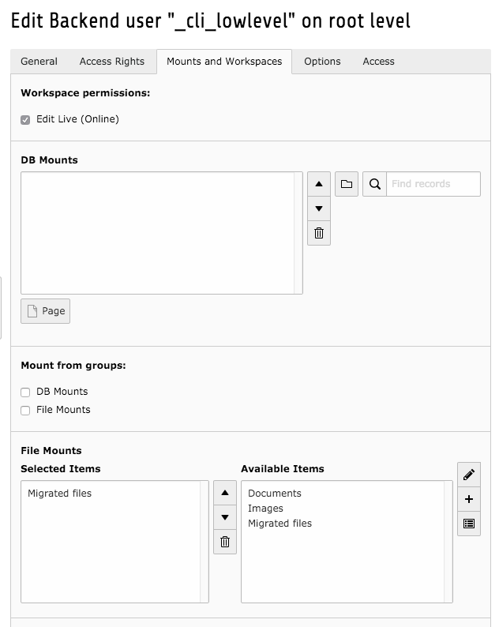

.. ==================================================
.. FOR YOUR INFORMATION
.. --------------------------------------------------
.. -*- coding: utf-8 -*- with BOM.

.. include:: ../Includes.txt

.. _usage:

=====
Usage
=====

Ensure the _cli_lowlevel user has the proper permissions
========================================================

The user running the command-line task must have persmissions to remove files from the `_migrated` folder. You will need to edit the `_cli_lowlevel` user in the backend and grant him/her access to a filemount containing the `_migrated` folder. If you don't do this, the files can not be deleted and the migration will exit.

   Create a filemount with access to the _migrated folder

   Attach the filemount to the _cli_lowlevel user

Rationale
=========
Here are my thoughts on undoubling the files in the _migrated folder. I you don't agree with this, or think the
apporach is wrong, please  send a pull request.

Undoubling files which have duplicates inside the _migrated folder
******************************************************************
All tasks should be executed on the contents of the _migrated folder first to resolve duplicates inside of there. Once
the duplicates have been removed from inside of the _migrated folder, we can also remove files from the _migrated folder
that have duplicates outside of there.

Build a map of unique sha1 values
^^^^^^^^^^^^^^^^^^^^^^^^^^^^^^^^^
First we ask the database to give us a list of file uids and sha1 values. Then we turn that into an array of unique
sha1 values and lowest uids. These files are most likely the 'original' files. Not the copies with _01, _02 etc. We
call this the sha1Map.

Build a map of duplicate files
^^^^^^^^^^^^^^^^^^^^^^^^^^^^^^
Then we fetch a list of all the file uids and their sha1 values. We iterate over the result and for each row we
look up the sha1 values in the sha1Map. If the value found in the sha1Map does not match the uid of the row, then
we are dealing with a duplicate. We know this because the sha1Map contains all unique sha1 values with the 'lowest'
ids.

We add the uid of the duplicate row to the idMap array. The index is the row uid and the value is the (lower) id we
found in the sha1Map.

Update references to duplicate files
^^^^^^^^^^^^^^^^^^^^^^^^^^^^^^^^^^^^
Now we can use the constructed idMap to update references pointing to files in the _migrated folder that have
duplicates.

Remove duplicate files without references
^^^^^^^^^^^^^^^^^^^^^^^^^^^^^^^^^^^^^^^^^
If we are positive that all references pointing to duplicates have been updated (to point to files outside of the
_migrated folder), we can remove the duplicate files.

Undoubling files that have duplicates outside of the _migrated folder
*********************************************************************
Now we execute the same tasks. This time however, we build the sha1 map only from files outside of the _migrated
folder.

In the status overview you may still find a lot of duplicate files after removing duplicates inside of the _migrated
folder. These are duplicates outside of the _migrated folder. We won't touch these files. The files may be needed
because different backend users have different filemounts and can access only files in their own filemount. So if they
want to use a file that is already on the system, but not in their filemount, they will need to (re-)upload it to their
own filemount.

Command Reference
=================

First do a dry-run to see what will be re-referenced.

.. code-block:: bash

    php ./typo3/cli_dispatch.phpsh extbase undouble:migrated --dry-run

If that output looks good:

.. code-block:: bash

   php ./typo3/cli_dispatch.phpsh extbase undouble:migrated

.. note::
  This reference uses ``./typo3/cli_dispatch.php extbase`` as the command to
  invoke.

The commands in this reference are shown with their full command identifiers.
On your system you can use shorter identifiers, whose availability depends
on the commands available in total (to avoid overlap the shortest possible
identifier is determined during runtime).

To see the shortest possible identifiers on your system as well as further
commands that may be available, use::

  ./typo3/cli_dispatch.php extbase help

.. note::
  Some commands accept parameters. See ``./typo3/cli_dispatch.phpsh extbase help <command identifier>`` for more information about a specific command.

.. contents:: Available Commands
  :local:
  :depth: 1
  :backlinks: top

undouble:status
***************

**Show status information**

undouble:migratedinmigratedfolder
*********************************

**Undouble files with duplicates inside of the _migrated folder**

Options
^^^^^^^

``--dry-run``
  Do a test run, no modifications.

undouble:migrated
*****************

**Undouble files with duplicates outside of the _migrated folder**

Options
^^^^^^^

``--dry-run``
  Do a test run, no modifications.

undouble:removeduplicatesinmigratedfolder
*****************************************

**Remove files with duplicates inside of the _migrated folder**

Removes files with counterparts inside of the _migrated folder and without references to them.

Options
^^^^^^^

``--dry-run``
  Do a test run, no modifications.
``--iupdated-references-and-have-backups``
  Do you know what you are doing? If provided, will remove the files. Can be used together with --dry-run to get a
  preview of the files to be removed.

undouble:removeduplicates
*************************

**Remove files with duplicates outside of the _migrated folder**

Removes files with counterparts outside of the _migrated folder and without references to them.

Options
^^^^^^^

``--dry-run``
  Do a test run, no modifications.
``--iupdated-references-and-have-backups``
  Do you know what you are doing? If provided, will remove the files. Can be used together with --dry-run to get a
  preview of the files to be removed.

undouble:updatetypolinkfields
*****************************

**Update typolink enabled fields**

Finds rich text fields with file references. If these links point to migratable files, they will be updated. The
TCA is inspected and all fields with a softref confiugration of type `typolink` will be processed. You can
also specify a table and field to process just that field.

The `$mode` parameter can be set to either `internal` or `regular`. If it is 'internal', the operation will be
performed with files having duplicates 'inside' of the _migrated folder. If set to 'regular', the operation will
be performed with files having duplicates 'outside' of the _migrated folder.

Options
^^^^^^^

``--table``
  The table to work on. Default: ``.
``--field``
  The field to work on. Default: ``.
``--dry-run``
  The mode to work in. Either 'internal' or 'regular'. Default: `internal`.

undouble:updatetypolinktagfields
********************************

**Update typolink_tag enabled fields**

Finds rich text fields with file references. If these links point to migratable files, they will be updated. The
TCA is inspected and all fields with a softref configuration of type `typolink_tag` will be processed. You can
also specify a table and field to process just that field.

The `$mode` parameter can be set to either `internal` or `regular`. If it is 'internal', the operation will be
performed with files having duplicates 'inside' of the _migrated folder. If set to 'regular', the operation will
be performed with files having duplicates 'outside' of the _migrated folder.

Options
^^^^^^^

``--table``
  The table to work on. Default: ``.
``--field``
  The field to work on. Default: ``.
``--dry-run``
  The mode to work in. Either 'internal' or 'regular'. Default: `internal`.
